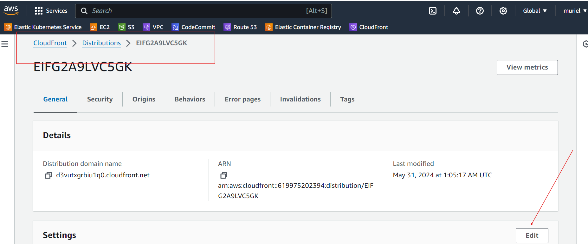

# s3bucket-cloudFront-SSLcertificat

Hello Cloud Enthusiasts, In my previous article, I explained in detail how to host a static website on AWS using S3. The static website had a bucket website endpoint which is long and is difficult for users to remember, also it is not secured. In this article, I will explain how to host static websites using S3, CloudFront, Route53 and ACM, these will make the website secured, have a custom domain name, fast and globally available with ultra minimal latency. So, Lets dive in …….

### OVERVIEW OF AWS SERVICES USED Amazon S3: 

1- Amazon S3 (Simple Storage Service) is a cloud-based object storage service provided by Amazon Web Services (AWS). It is designed to store and retrieve any amount of data over the internet. S3 is highly scalable, durable, and secure, making it one of the most popular storage solutions for various types of data, including images, videos, documents, backups, and application data. It offers 99.999999999% (11 nines) durability for stored objects.

2- CloudFront: Amazon CloudFront is a content delivery network (CDN) service designed to deliver content, including web pages, images, videos, applications, and other static and dynamic assets, to users with low latency and high data transfer speeds. CloudFront accelerates the delivery of content by caching it in a network of globally distributed edge locations, which are geographically distributed data centers around the world.
It integrates with other AWS services like AWS Identity and Access Management (IAM) and AWS Certificate Manager (ACM) for secure access and SSL/TLS encryption.

3- Route53: Route 53 is a highly scalable and reliable Domain Name System (DNS) web service provided by Amazon Web Services (AWS). It is named after the UDP port 53, which is used for DNS requests. Route 53 helps businesses and developers manage and route internet traffic for domain names and web applications with high availability, low latency, and robust DNS management capabilities.

4-Amazon Certificate Manager (ACM): AWS Certificate ManagerACM allows you to request public SSL/TLS (Secure Sockets Layer/Transport Layer Security) certificates for domain names used with AWS services, such as Amazon CloudFront, Elastic Load Balancing, Amazon API Gateway, and more.

### Lets Host our website in a secured, reliable and fast way in the following steps!!!
Step1: Create an S3 Bucket for static website hosting on your command line.(you can use powershell, gitBash, Ubuntu....system)

To create/make a bucket use aws s3 mb bucket-uri    

    `aws s3 mb s3://mynewbucket151`

 or 

    `aws s3api create-bucket --bucket mynewbucket009`

* Copy all files and folders of your static-Wbsite in your S3 Bucket using this command:

        `aws s3 cp  .\website folder\ s3://bucket name --recursive`

*   Access your bucket in AWS and do the necessery configurations

Step2: Setting Up AWS CloudFront

 *  After configuring my S3 bucket to host the static website, I moved on to setting up AWS CloudFront to distribute the content globally. First, I navigated to the CloudFront service by searching for "CloudFront" in the AWS Management Console.

*    I initiated the creation of a new distribution by clicking on Create distribution. For the origin domain, I selected my S3 bucket URL from the dropdown, In setting up the origin access, I chose the Origin access control settings. I clicked on Create new OAC, and a pop-up appeared where I verified that my origin name was correctly showing. I left all other settings default and proceeded to create the OAC.

First, i went to the my bucket permission and Block all public access.

 *  Continuing with the configuration, I scrolled down to the distribution settings and set the Default root object to index.html, ensuring that CloudFront serves the index.html file when accessing the root URL of the distribution.

*   Upon clicking Create distribution, CloudFront began to deploy, and it automatically generated a new policy for the S3 bucket. I copied this policy and went back to my S3 bucket settings to update the policy accordingly. This ensures that the permissions are correctly set to allow CloudFront to access the S3 bucket.

*   Went the CloudFront Distribution was Enable, i clicked on the distribution ID, copied the distribution domain name and pasted in a new tab my browser.

Behold, my static-website was successfully deployed and secure as expected.

---
---

Step3  Configure Route53 for DNS Management

Prior to configuring Route53 for DNS management, We need to purchase a custom domain name from a domain registrar, you can buy a domain name on namecheap, or GoDaddy. You can also use the one you have in AWS.

Next, on the AWS Console, search for Route53, click on it then click on hosted zones and create hosted zone.

---
---

Step4: Create a SSL/TLS Certificate for CloudFront

On the AWS console search for “AWS Certificate Manager” (ACM), click on Certificate Manager

Once there, select “Request a certificate.” In the provided field, enter your custom domain name (e.g., murielapps.net). Choose DNS validation as the preferred method and proceed by clicking on the “Request”.

Click on “View Certificate”, then click on the certificate ID and click on “create records in route53”, click on “create records” then wait while the status change from “pending validation” to “issued.

Go back to Route53, refresh the page, you should see a new CNAME record and you are done with ACM.
---
---

step5: EDIT CloudFront Distributions for Website Delivery

On the AWS console, search for CloudFront. On the CloudFront dashboard, click on “create CloudFront distribution ID”, scroll down to settings and select edit provide:

 -The Alternate domain name (Exemple: murielapps.net)

-Select you SSL certificate

- Save changes

Now, navigate back to cloudfront. Access your website securely by following these steps: Go to the “General” section of your distribution dashboard and copy the CloudFront “Distribution domain name.” Then, paste it into your web browser.

---
---
You will observe that the “Distribution domain name” is too long and will not be easy for clients or users to remember. This brings us to the final step which is “Configuring Route53 for DNS Management”.

 ###    Configuring Route53 for DNS Management ( create A RECORD for CloudFront Distribution)

To set up a record in the Route53 dashboard, click on the hosted zone, locate your domain name, and click “Create record.

*   Turn on the alias option, specify the record type, in the “Route traffic to” field, select your CloudFront “Distribution domain name” and chose the simple routing policy, then click on “create records”.

After creating your records, click on “View status” to determine when your domain name is ready for use in accessing your website.

If the status is “INSYNC”, this means you can now access your website using your custom domain.

Type your custom domain on your browser to view your website fully secured, fast and reliable.

Congratulations on successfully hosting your static website on AWS in just 5 steps. Amazon S3, CloudFront, ACM and Route53 together provide a powerful solution for Hosting, Caching, and DNS management, ensuring a reliable and cost-effective hosting experience on AWS. Thank you for following this guide until the end, and here’s to many more successful hosting endeavors! Cheers!

